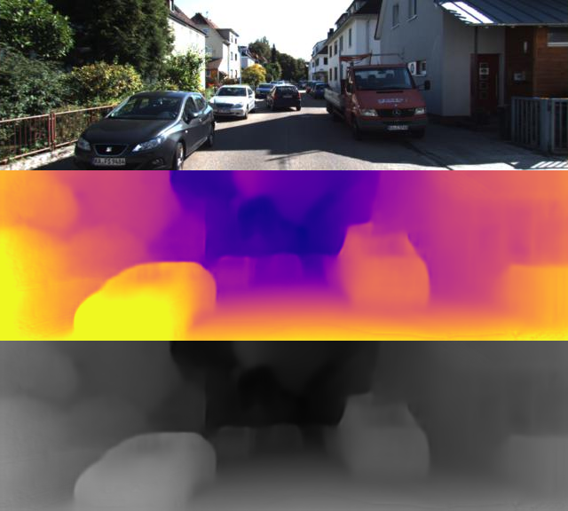

# tf-monodepth2

<b>Update:</b>  <font color="red">2019-10-09: 1) fix small bug to get better results; </font>

<b>Right now, BatchNormalization is not fixed, we evaluate depth with is_training = True, trying to fix it!</b>

Update:  <font color="red">2019-09-23: 1) modify pose decoder to be consistent with original monodepth2; 2)add evaluate code for estimated depth</font>

This is tensorflow(unofficial) implementation for the method in

> **Digging into Self-Supervised Monocular Depth Prediction**
>
> [Clément Godard](http://www0.cs.ucl.ac.uk/staff/C.Godard/), [Oisin Mac Aodha](http://vision.caltech.edu/~macaodha/), [Michael Firman](http://www.michaelfirman.co.uk) and [Gabriel J. Brostow](http://www0.cs.ucl.ac.uk/staff/g.brostow/)  
>
> [arXiv 2018](https://arxiv.org/abs/1806.01260)

<p align="center">
  
</p>

Code mainly based on [SFMLearner](https://github.com/tinghuiz/SfMLearner) and [SuperPoint](https://github.com/rpautrat/SuperPoint)

If you find this work useful in your research please consider citing author's paper:

```
@article{monodepth2,
  title     = {Digging into Self-Supervised Monocular Depth Prediction},
  author    = {Cl{\'{e}}ment Godard and
               Oisin {Mac Aodha} and
               Michael Firman and
               Gabriel J. Brostow},
  journal = {arXiv:1806.01260},
  year = {2018}
}
```
## Demonstration
<p align="center">
<a href="https://www.youtube.com/watch?v=TUgaPZgdEys
" target="_blank"></a>
</p>


## Prerequisites

This codebase was developed and tested with Tensorflow 1.6.0, CUDA 8.0 and Ubuntu 16.04.

## Setup
Assuming a fresh [Anaconda](https://www.anaconda.com/download/) distribution, you can install the dependencies with:
```shell
conda env create -f environment.yml
conda activate tf-monodepth2
```

## Preparing training data
In order to train the model using the provided code, the data needs to be formatted in a certain manner. 

For [KITTI](http://www.cvlibs.net/datasets/kitti/raw_data.php), first download the dataset using this [script](http://www.cvlibs.net/download.php?file=raw_data_downloader.zip) provided on the official website, and then run the following command
```bash
python data/prepare_train_data.py --dataset_dir=/path/to/raw/kitti/dataset/ --dataset_name='kitti_raw_eigen' --dump_root=/path/to/resulting/formatted/data/ --seq_length=3 --img_width=416 --img_height=128 --num_threads=4
```

## Training(Only Monocular)

First of all, set dataset/saved_log path at monodepth2_kitti.yml

```shell
python monodepth2.py train config/monodepth2_kitti.yml your_saved_model_name
```

<p align="center">
  
</p>

## Testing
```
python monodepth2.py test config/monodepth2_kitti.yml your_pretrained_model_name
```

~~Pretrained model download link: [monodepth2_416*128_mono](https://drive.google.com/file/d/1oALNcevZSEvDHkjF1NX1Jf7JExWW52k-/view)~~
<font color="red">Pretrained model will be uploaded soon. Former model is no longer suitable for this code.</font>

## Evaluation
* First we need to save predicted depth image into npy file
```
python monodepth2.py eval config/monodepth2_kitti_eval.yml your_pretrained_model_name depth
```
Save destination should be setted in monodepth2_kitti_eval.yml.
* Then we use evaluation code to compute error result:
```
cd kitti_eval
python2 eval_depth.py --kitti_dir=/your/kitti_data/path/ --pred_file=/your/save/depth/npy/path/ --test_file_list=../data/kitti/test_files_eigen.txt
```
Note: please use python2 to execute this bash.

<font color="red">kitti_eval code from Zhou's SFMLearner</font>

Pose evaluation code to be completed.

|  model_name  | abs_rel | sq_rel | rms | log_rms | δ<1.25 | δ<1.25^2 | δ<1.25^3 |
|  ----  |  ----  |  ----  |  ----  |  ----  |  ----  |  ----  |  ----  |
| `mono_no_pt_640x192` | 0.1334 | 0.9895 | 5.1247 | 0.2084 | 0.8402 | 0.9480 | 0.9785 |

## Reference Codes
- Monodepth2
  - https://github.com/nianticlabs/monodepth2

- SfmLearner
  - https://github.com/tinghuiz/SfMLearner

- SuperPoint
  - https://github.com/rpautrat/SuperPoint
  
- resnet-18-tensorflow
  - https://github.com/dalgu90/resnet-18-tensorflow

## TODO
- [x] Auto-Mask loss described in paper
- [x] ResNet-18 Pretrained Model code
- [x] Testing part
- [ ] Evaluation for pose estimation
- [ ] stereo and mono+stereo training


